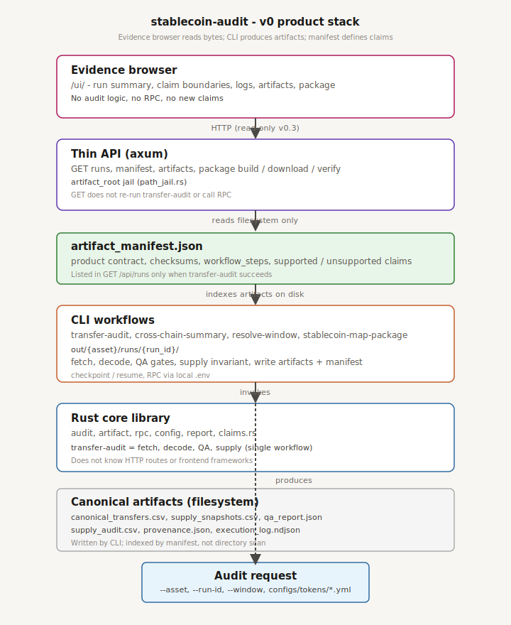

# Backend architecture (v0)

## Product positioning

`stablecoin-audit` is a **Rust toolkit for generating reproducible stablecoin audit evidence**. Auditors and researchers run CLI workflows against configured EVM deployments and block windows; the toolkit writes filesystem artifacts with explicit provenance and claim boundaries.

It is **not**:

- a risk oracle or safety score
- a reserve or attestation audit
- a country-adoption or geo dashboard
- a swap-routing or liquidity execution engine

The core product question:

> Given a stablecoin deployment, block window, and evidence source configuration, what can this toolkit prove, what artifacts does it generate, and what claims remain outside the evidence boundary?

Answers live in **artifacts + manifests**, not in a hosted dashboard’s business logic.

## Architecture layers

The toolkit stacks five conceptual layers (see [`audit_semantics_v0.md`](audit_semantics_v0.md) for claim and audit-plan detail):

```text
Product (API, package, UI) → Artifact (manifest, files) → Claim (supported_claims)
  → Audit engine (CLI workflows) → Evidence (CSV/JSON/MD from RPC)
```

`artifact_manifest.json` is the **product run contract** — not the audit itself. It indexes artifacts and records claim boundaries; `supported_claims` / `unsupported_claims` are the semantic audit output.

## Architecture layers (implementation — current v0)

Detailed current-vs-target pipeline diagrams: [`audit_product_pipeline_v0.md`](audit_product_pipeline_v0.md).



*Evidence browser → read-only API → `artifact_manifest.json` → CLI workflows → Rust core. Blog-scale horizontal diagrams: `.local/blog/figures/`.*

```text
┌─────────────────────────────────────────────────────────────┐
│  Evidence browser (/ui/) — read-only, served by API          │
│  Reads manifest + artifact bytes — no audit logic           │
└───────────────────────────────┬─────────────────────────────┘
                                │ HTTP (read-only v0.3)
┌───────────────────────────────▼─────────────────────────────┐
│  Thin API (v0.3) — axum, artifact_root jail                  │
│  Runs, manifests, artifacts, package build/verify/download   │
└───────────────────────────────┬─────────────────────────────┘
                                │ reads filesystem only
┌───────────────────────────────▼─────────────────────────────┐
│  artifact_manifest.json — product contract (claims, checksums) │
└───────────────────────────────┬─────────────────────────────┘
                                │
┌───────────────────────────────▼─────────────────────────────┐
│  CLI — transfer-audit, cross-chain-summary, …                │
│  Writes out/<asset>/runs/<run_id>/ + artifact_manifest.json  │
└───────────────────────────────┬─────────────────────────────┘
                                │
┌───────────────────────────────▼─────────────────────────────┐
│  Rust core library                                           │
│  audit · artifact · rpc · config · report                  │
│  transfer-audit = single workflow (fetch→decode→QA→supply)   │
└─────────────────────────────────────────────────────────────┘
```

**Not implemented today:** HTTP audit request orchestration, independent evidence-collection service, separate `supply-audit` / `bridge-backing-audit` / `liquidity-exposure-audit` CLI engines.

### 1. Rust core library

**Owns:** domain models, workflow orchestration, artifact contracts, claim boundaries, source metadata, evidence packaging, RPC fetch/decode/report logic (existing `src/rpc/*`, `config`, `report`, etc.).

**Does not know:** HTTP routes, cookies, frontend frameworks.

**Callable by:** CLI today; API handlers in v0.3 (same crate, no logic duplication).

Suggested module boundaries (v0.2+):

| Module | Responsibility |
|--------|----------------|
| `domain/` | Asset/chain/window identifiers; shared value types; validation rules |
| `application/` | Workflow entrypoints and composition (thin in v0.2; grows without moving audit math) |
| `artifact/` | `ArtifactManifest`, writers, checksums, schema version |
| `rpc/` | Existing per-command implementations (unchanged semantics in v0.2) |
| `report/` | Output path helpers (`out/<asset>/runs/<run_id>/`) |
| `cli/` | Argument parsing and dispatch only |

### 2. CLI

**Owns:** Developer/auditor UX — `clap` structs, validation of flags, tokio runtime bootstrap, calling `rpc::*::run`, printing paths and gate summaries.

**Does not own:** New audit definitions (those stay in `rpc` until deliberately refactored into `application`).

Existing commands (0.1.0) remain: `transfer-audit`, `cross-chain-summary`, `resolve-window`, `metadata`, `stablecoin-map-package`, plus experimental `fetch` / `report` / `control-*`.

### 3. Thin API wrapper (v0.3)

**Owns:** Serving pre-generated artifacts from `--artifact-root`; listing runs; returning manifest JSON.

**Does not:** Re-run audits on GET; proxy shell commands; generate charts; call RPC.

**Status:** Read-only API + evidence browser shipped (`--features api`, `/ui/`). See [`api_design_v0.md`](api_design_v0.md), [`evidence_browser_v0.md`](evidence_browser_v0.md).

**Does not:** Re-run audits on GET; `POST /api/runs` orchestration (roadmap v0.4); proxy shell commands; generate charts; call RPC.

### 4. Frontend evidence browser

**Status:** Implemented — static UI at `/ui/` served by the API.

**Owns:** Presentation — run list, claim boundaries, artifact table, package actions.

**Reads:** `GET /api/runs`, manifest, and artifact bodies.

**Does not:** Recompute supply invariants, parse Transfer logs, or call RPC.

## Why the frontend is only an evidence browser

Audit semantics are versioned in Rust (decode rules, gate definitions, block pinning). If the frontend encodes those rules, evidence drifts from the toolkit: two implementations, two PASS/FAIL meanings.

The manifest’s `supported_claims` / `unsupported_claims` fields document what the **toolkit** attests. The UI renders that contract; it does not extend it.

## Filesystem layout (runs)

Default artifact root aligns with CLI output:

```text
out/
  <asset>/
    runs/
      <run_id>/
        artifact_manifest.json   # v0.2+ product manifest (alongside legacy files)
        audit_plan.json          # v0 audit scope and requested checks
        provenance.json
        qa_report.json
        supply_audit.csv
        summary.md
        ...
    metadata.json                # metadata command
```

Published benchmarks under `docs/benchmarks/<run_id>/` mirror the same filenames for git-backed evidence.

## Roadmap

| Version | Goal | Status |
|---------|------|--------|
| **v0.2** | Module refactor + `ArtifactManifest` schema + product docs | Shipped |
| **v0.3** | Read-only `serve` API over `artifact_root` | Shipped (`--features api`) |
| **v0.3.5** | Evidence browser at `/ui/` | Shipped |
| **v0.4** | POST runs, status, logs, cancel; job queue | Roadmap |
| **v0.5+** | Independent audit engines (supply-audit, bridge-backing, liquidity) | Roadmap |

## Public API boundaries (library)

**Stable for integrators (grow deliberately):**

- `stablecoin_audit::run_cli` — binary and tests
- `report::{ensure_run_out_dir, validate_run_id, default_run_id}`
- `artifact::manifest::*` — manifest types and serialization
- Future: `application::workflow::*` — named workflow runners without CLI

**Internal / unstable:**

- `rpc::*` — command-specific; may move behind `application` without semantic changes
- Checkpoint manifest (`transfer_checkpoint::CheckpointManifest`) — resume only, not the product manifest

## Relationship to existing artifacts

v0.1 commands already emit `provenance.json`, `qa_report.json`, `supply_audit.csv`, etc. v0.2 adds a **unifying** `artifact_manifest.json` that indexes those files and states claim boundaries. Legacy files remain until each workflow optionally writes the product manifest at end of run (incremental adoption in later PRs).
